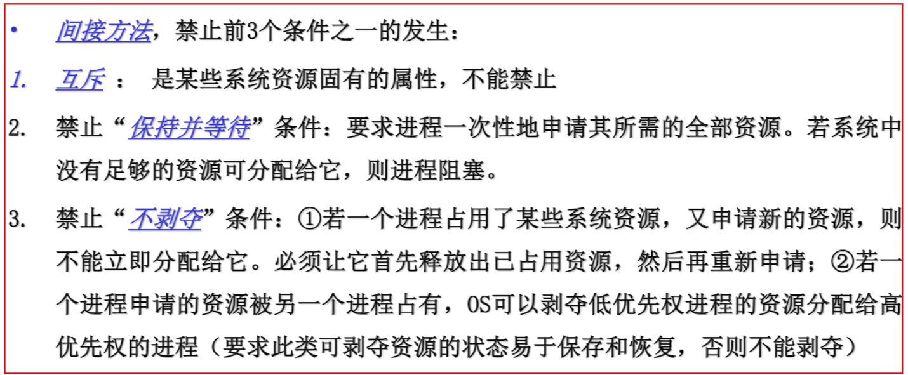
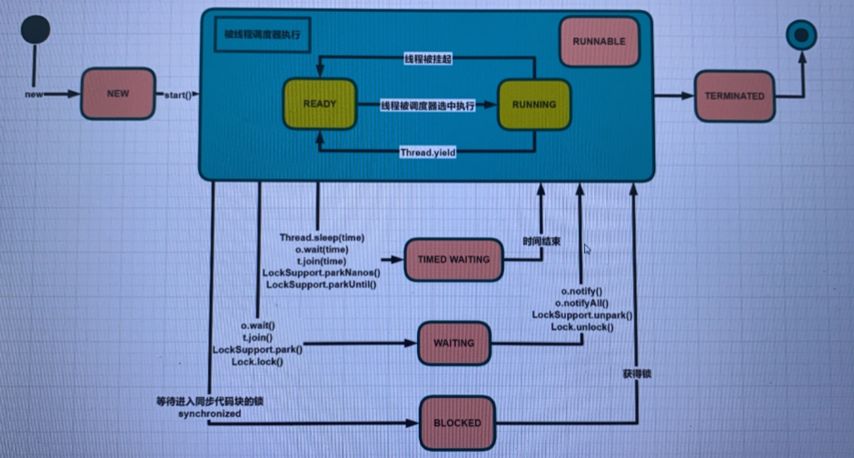
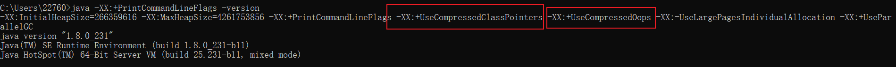
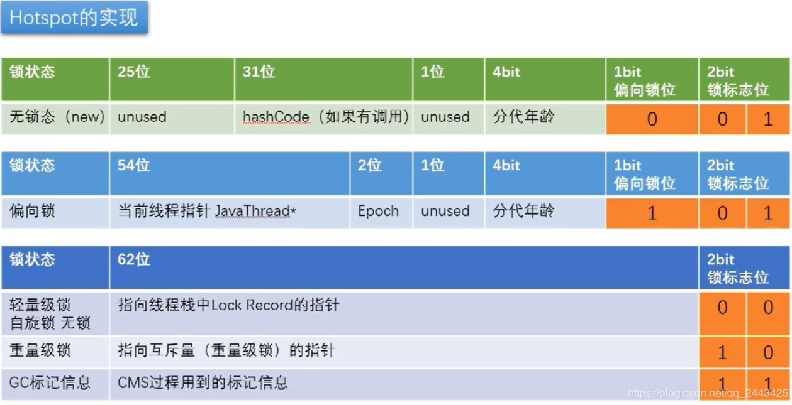
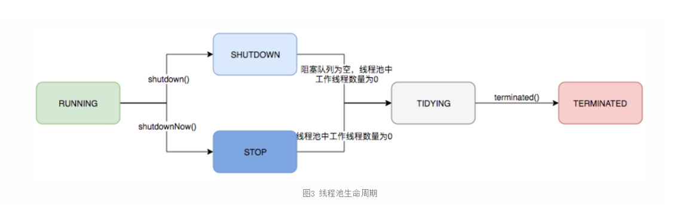
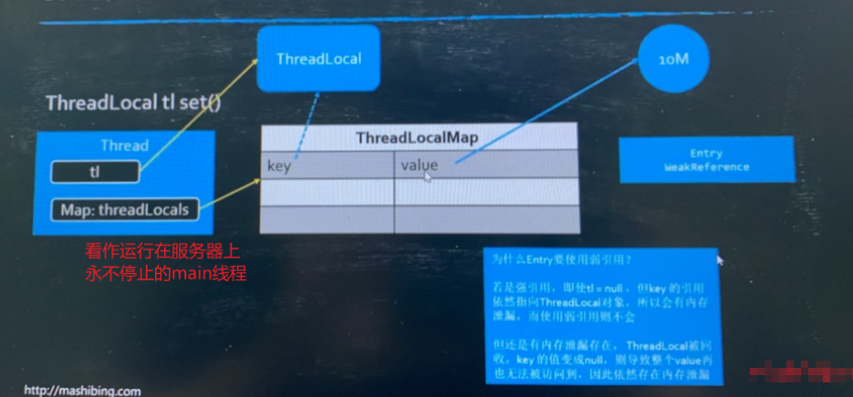
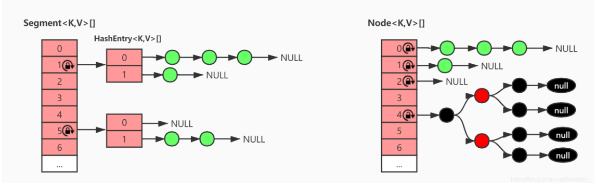

# 如何预防死锁?

1.首先得讲出死锁得四个必要条件:

1. 互斥

   >请求的资源互斥

2. 请求和保持

   >请求新的资源，没得到，阻塞，但是对已有的不释放

3. 不可抢占

   >进程已获得资源应由其自己释放，不能在未完成使用前被其他进程抢占

4. 循环等待（充分条件--->形成环路必然死锁，满足前面三个条件只会可能死锁）

   >进程之间请求资源形成环路

2.讲出预防死锁

1. 预防死锁（都不可行）

   >
   >
   >**间接方法**:
   >
   >4.禁止"循环等待"
   >
   >采用资源有序分配其基本思想是将系统中的所有资源顺序编号，将紧缺的，稀少的
   >采用较大的编号，在申请资源时必须按照编号的顺序进行，一个进程只有获得较小
   >编号的进程才能申请较大编号的进程  

2. 避免死锁

   >银行家算法

3. 检测死锁

   >事先不采取措施，允许死锁发生，OS周期性的执行死锁检测的例程，检测系统中是否出现“环路等待”

4. 解除死锁

   >检测到死锁已经发生，撤销一些进程，回收它的资源，将其分配给因资源导致阻塞的进程运行

# 描述一下线程安全的活跃态问题,竞态条件?

线程安全的活跃性问题可以分为 :死锁,活锁,饥饿

1. 死锁

   >两个线程或多个线程都持有对方需要的锁,但是同时也都在请求对方持有的锁,互相等待,拿不到对方的锁也不释放自己持有的锁,形成一个循环等待的过程
   >
   >**解决办法**: 使用tryLock一旦超时,释放已经持有的锁,隔一段时间再来重试

2. 活锁

   >虽然不会阻塞线程,但是也不能继续执行其他的代码,因为线程将不断的重复执行相同的操作,而且总是失败.
   >
   >活锁通常发生在处理事务消息的应用程序中 ： 
   >
   >​		消费端如果不能成功地处理某个消息， 那么消息处理机制将回滚整个事务， 并将它重新放
   >
   >到队列的开头。当消费端又将队列头部的消息拿出来消费，但是消息仍然处理失败.就这样循环
   >
   >反反复复, 虽然处理消息的线程并没有阳塞， 但也无法继续执行下去。 这种形式的活锁通常是
   >
   >由过度的错误恢复代码造成的， 因为它错误地将不可修复的错误作为可修复的错误 .
   >
   >**解决办法:**尝试等待一个随机的时间去重试就行

3. 饥饿

   >饥饿分两种:
   >
   >​	1.由于占有某个锁的线程一直不释放锁,其他线程一直拿不到锁无法进入临界区,对于其他线程来说就是"饥饿"
   >
   >​	2.线程的优先级分配不合理,导致优先级低的线程始终得不到执行,造成"饥饿"
   >
   >开发中容易造成饥饿的典型用例就是Read-Write Lock

竞态条件: 

> 书上用星巴克的例子说明
>
> 当某个计算的正确性取决于多个线程的交替执行时序时， 那么就会发生竞态条件。 换句话说， 就是正确的结果要取决于运气  
>
> 由此出现"先检查后执行"的操作
>
> 典型例子:DCL单例

# Java中的wait和sleep的区别与联系？

1. 所属类: 首先，这两个方法来自不同的类分别是Thread和Object ，wait是Object的方法，
    sleep是Thread的方法

  > sleep方法属于Thread类中方法，表示让一个线程进入睡眠状态，等待一定的时间之
  > 后，自动醒来进入到可运行状态，不会马上进入运行状态，因为线程调度机制恢复线程
  > 的运行也需要时间，一个线程对象调用了sleep方法之后，并不会释放他所持有的所有对
  > 象锁，所以也就不会影响其他进程对象的运行。但在sleep的过程中过程中有可能被其他
  > 对象调用它的interrupt(),产生InterruptedException异常，如果你的程序不捕获这个异
  > 常，线程就会异常终止，进入TERMINATED状态，如果你的程序捕获了这个异常，那么
  > 程序就会继续执行catch语句块(可能还有finally语句块)以及以后的代码
  >
  > wait是Object的方法,java里面的锁,其实就是一个对象,线程只有拿到对象的监视器才能进入这个对象锁
  >
  > 住的同步代码块,然后调用该锁对象的wait方法.

2. 作用范围: sleep方法没有释放锁，只是休眠，而wait释放了锁，使得其他线程可以进入同步控
    制块或方法

3. 使用范围: wait只能在同步控制方法或者同步控制块里面使用，而sleep可
    以在任何地方使用

4. 异常范围：sleep存在受查异常,编译期就能检查到,必须捕获，而wait可能存在运行时异常

#  描述一下进程与线程区别？

1. 进程: 

   > 定义:OS进行资源分配和调度的基本单位.
   >
   > 当一个程序QQ.exe静静的躺在磁盘上时,他还是一个程序,当我们用鼠标点击一下QQ.exe时,操作系统要调用do_fork()创建一个QQ的进程,要为我们的进程创建进程控制块PCB,分配内存空间,把我们的程序的一部分数据加载到内存.此时我们的QQ是活的了,它参与计算机的资源竞争,还参与调度,这就是一个进程

2. 线程:

   >定义:OS进行运算调度的基本单位
   >
   >在刚刚已经创建好了的QQ进程下,如果我们让OS调用do_clone()并传入QQ进程的一些信息,此时我们又会创建一个进程,但是它不会再要求OS进行资源的分配,他会共享QQ进程的资源,但是OS会有该进程的PCB,所以它参与调度.从定义上看该进程只参与调度所以他就是个线程.

# 描述一下Java线程的生命周期?



# 程序开多少线程合适?

1. CPU密集型的话:

   >减少线程间的切换,创建较少的线程比较好
   >
   >单核CPU:单线程
   >
   >多核CPU: N+1,多一个线程是为了避免某个线程出错,造成CPU空闲

2. I/O密集型的话:

   >为了避免CPU空闲,想创建越多的线程让CPU调度
   >
   >理论上  CPU核心数 (1 + (I/O耗时/CPU耗时))  ,当CPU耗时趋近0时,线程的数量趋近2N      p113
   >
   >具体还得压测,让机器的吞吐量响应时间达到一个峰值

# 描述一下notify和notifyAll区别?

锁池 EntryList:

> 每一个对象锁都维护着一个锁池,里面记录着正在竞争当前对象锁 (但是没拿到锁) 的线程.

等待池 waitSet:

>每一个对象锁都维护着一个等待池,池里面的线程不能参与锁的竞争,拿到锁的线程在同步块中调用wait()方法,该线程释放拥有的锁,并进入等待池

notify: 随机唤醒等待池里面的一个线程进入锁池,可以参与锁的竞争

notifyAll: 将等待池里面的所有线程全部唤醒,都进入锁池,参与锁的竞争

# 描述一下synchronized和lock区别 ?

|             | synchronized                                                 | Lock                                                         |
| ----------- | ------------------------------------------------------------ | ------------------------------------------------------------ |
| 存 在 层 次 | Java的关键字，在jvm层面上                                    | 是JVM的一个接口                                              |
| 锁 的 获 取 | 假设A线程获得锁，B线程等待。如果A线程阻塞，B线程会一直等待   | 情况而定，Lock有多个锁获取的方式: 1.lock()方式和synchronized一样,线程没拿到锁会一直阻塞2.tryLock()线程在期限时间内没拿到锁可以继续执行下面的代码 |
| 锁 的 释 放 | 1.获取锁的线程执行完同步代码, 释放锁  2.线程执行发生异常,jvm会自动将锁释放 | 在finally中必须手动释放锁,不然容易造成线程死锁               |
| 锁 类 型    | 锁可重入、不可中断、非公平                                   | 可重入,可选择公平与非公平(默认非公平)                        |
| 性 能       | 存在锁升级过程                                               | 看个人对并发控制的粒度                                       |

# 说一下synchronized的加锁流程

先说一下对象的内存布局:

**普通对象**(new Object() 16字节)

1. 对象头 markword 8字节

2. ClassPointer指针(指向Class对象的指针)   -XX:+UseCompressedClassPointers 为4字节 不开启为8字节

3. 实例数据(8大基本数据类型大小,引用数据类型 -XX:+UseCompressedOops 为4字节 不开启为8字节 ) 

4. padding 对齐(保证对象的总大小为8的倍数)

   上面的参数用java -XX:+PrintCommandLineFlags -version 观察虚拟机的配置

   

**数组对象**(new Long[5]    8(markword)+4(classPointer)+4(length)+4*5+4(padding)=40 字节)

比普通对象多一个数组的长度length 4字节


**Markword**



1. 由于HotSpot的作者经过研究发现，大多数情况下，锁不仅不存在多线程竞争，而且总是由同
   一线程多次获得，为了让线程获得锁的代价更低从而引入偏向锁。偏向锁在获取资源的时候会
   在锁对象头上记录当前线程ID，偏向锁并不会主动释放，这样每次偏向锁进入的时候都会判
   断锁对象头中线程ID是否为自己，如果是当前线程重入，直接进入同步操作，不需要额外的
   操作。默认在开启偏向锁和轻量锁的情况下，当线程进来时，首先会加上偏向锁，其实这里只
   是用一个状态来控制，会记录加锁的线程，如果是线程重入，则不会进行锁升级。获取偏向锁
   流程：

   > Ⅰ. 判断是否为可偏向状态--MarkWord中锁标志是否为‘01’，偏向锁位是否为‘1’
   >
   > Ⅱ. 如果是可偏向状态，则查看线程ID是否为当前线程，如果是，则进入步骤 'V'，否则进入
   > 步骤‘III’
   >
   > Ⅲ. 通过CAS操作竞争锁，如果竞争成功，则将MarkWord中线程ID设置为当前线程ID，然
   > 后执行‘V’；竞争失败，则执行‘IV’
   >
   > Ⅳ. CAS获取偏向锁失败表示有竞争。当达到safepoint时获得偏向锁的线程被挂起，偏向锁
   > 升级为轻量级锁，然后被阻塞在安全点的线程继续往下执行同步代码块
   >
   > Ⅴ. 执行同步代码

2. 轻量级锁是相对于重量级锁需要阻塞/唤醒涉及上下文切换而言，主要针对多个线程在不同时
   间请求同一把锁的场景。轻量级锁获取过程：

   > Ⅰ. 进行加锁操作时，jvm会判断是否已经是重量级锁，如果不是，则会在当前线程栈帧中划
   > 出一块空间，作为该锁的锁记录Lock Record，并且将锁对象MarkWord复制到该锁记录中
   >
   > Ⅱ. 复制成功之后，jvm使用CAS操作将对象头MarkWord更新为指向锁记录的指针，并将锁
   > 记录里的owner指针指向对象头的MarkWord。如果成功，则执行‘III’，否则执行‘IV’
   >
   > Ⅲ. 更新成功，则当前线程持有该对象锁，并且对象MarkWord锁标志设置为‘00’，即表示此
   > 对象处于轻量级锁状态
   >
   > Ⅳ. 更新失败，jvm先检查对象MarkWord是否指向当前线程栈帧中的锁记录，如果是则执
   > 行‘V’，否则执行‘VI’
   >
   > Ⅴ. 表示锁重入；然后当前线程栈帧中增加一个锁记录第一部分（Displaced Mark Word）
   > 为null，并指向Mark Word的锁对象，起到一个重入计数器的作用
   >
   > Ⅵ. 表示该锁对象已经被其他线程抢占，则进行自旋等待（默认10次），等待次数达到阈值
   > 仍未获取到锁，则升级为重量级锁

3.  当有多个锁竞争轻量级锁则会升级为重量级锁，重量级锁正常会进入一个cxq的队列，在调用
   wait方法之后，则会进入一个waitSet的队列park等待，而当调用notify方法唤醒之后，则有
   可能进入EntryList。重量级锁加锁过程:

   > Ⅰ. 分配一个ObjectMonitor对象，把Mark Word锁标志置为‘10’，然后Mark Word存储指向
   > ObjectMonitor对象的指针。ObjectMonitor对象有两个队列和一个指针，每个需要获取
   > 锁的线程都包装成ObjectWaiter对象
   >
   > Ⅱ. 多个线程同时执行同一段同步代码时，ObjectWaiter先进入EntryList队列，当某个线程
   > 获取到对象的monitor以后进入Owner区域，并把monitor中的owner变量设置为当前线
   > 程同时monitor中的计数器count+1

# 简单描述一下ABA问题?

```java
// this:需要修改的类 stateOffset:需要修改的列在类中的偏移量  expect:期望值  update:更新的值
unsafe.compareAndSwapInt(this, stateOffset, expect, update)
```

1.  有两个线程同时去修改一个变量的值，比如线程1、线程2，都更新变量值，将变量值从A更新成
   B。
2.  首先线程1、获取到CPU的时间片，线程2由于某些原因发生阻塞进行等待，此时线程1进行比较更
   新（CompareAndSwap），成功将变量的值从A更新成B。
3. 更新完毕之后，恰好又有线程3进来想要把变量的值从B更新成A，线程3进行比较更新，成功将变
   量的值从B更新成A。
4. 线程2获取到CPU的时间片，然后进行比较更新，发现值是预期的A，然后有更新成了B。但是线程
   1并不知道，该值已经有了

>A->B->A这个过程，这也就是我们常说的ABA问题  
>
>可以通过加版本号或者加时间戳解决(AtomicStampedReference)，或者保证单向递增或者递减就不会存在此类问题

# 多线程之间是如何通信的?

从OS的角度来说进程之间的通信:  信号量,套接字,管道,共享内存,MQ

由于多线程共享了进程的内存空间,地址空间,一旦线程修改了进程内存空间的变量,其他线程自然能看到,所以线程间原生支持通信

但是线程间并发必然引起互斥操作,这时就需要一些同步机制,由此诞生Java层面的:

1. 通过共享变量，变量需要volatile 修饰 
2. wait()和notify(),notifyAll() 
3. Condition的await()和signalAll()方法 

# 线程池拒绝策略

1.  第一种拒绝策略是 AbortPolicy，这种拒绝策略在拒绝任务时，会直接抛出一个类型为 RejectedExecutionException 的 RuntimeException，让你感知到任务被拒绝了，于是你便可以根据业务逻辑选择重试或者放弃提交等策略。
2. 第二种拒绝策略是 DiscardPolicy，这种拒绝策略正如它的名字所描述的一样，当新任务被提交后直接被丢弃掉，也不会给你任何的通知，相对而言存在一定的风险，因为我们提交的时候根本不知道这个任务会被丢弃，可能造成数据丢失。
3. 第三种拒绝策略是 DiscardOldestPolicy，如果线程池没被关闭且没有能力执行，则会丢弃任务队列中的头结点，通常是存活时间最长的任务，这种策略与第二种不同之处在于它丢弃的不是最新提交的，而是队列中存活时间最长的，这样就可以腾出空间给新提交的任务，但同理它也存在一定的数据丢失风险。
4.  第四种拒绝策略是 CallerRunsPolicy，相对而言它就比较完善了，当有新任务提交后，如果线程池没被关闭且没有能力执行，则把这个任务交于提交任务的线程执行，也就是谁提交任务，谁就负责执行任务。这样做主要有两点好处。

# 未使用的线程池中的线程放在哪里?

```java
private final HashSet<Worker> workers = new HashSet<Worker>();
```

# cache线程池会不会销毁核心线程?

```java
public void allowCoreThreadTimeOut(boolean value) 
```

# Java多线程的几种状态及线程各个状态之间是如何切换的?

| 运行状态   | 状态描述                                                     |
| ---------- | ------------------------------------------------------------ |
| running    | 能接受新提交的任务,并且也能处理阻塞队列中的任务              |
| shutdown   | 关闭状态,不再接受新提交的任务.但却可以继续处理阻塞队列中已经保存的任务 |
| stop       | 不能接收新任务,也不处理队列中的任务,会中断正在处理的线程     |
| tidying    | 所有的任务已经终止,wokerCount = 0                            |
| terminated | 在terminated()方法执行后进入此状态                           |

  

# 如何在方法栈中进行数据传递?

1. 通过方法参数传递 
2. 通过共享变量 
3. 如果在用一个线程中,还可以使用ThreadLocal进行传递 

# ThreadLocal底层实现形式及实现的数据结构



# 描述一下AQS?

AQS中定义了一个状态变量state，它有以下两种使用方法：

**AQS中维护了一个队列，获取锁失败（非tryLock()）的线程都将进入这个队列中排队，等待锁释放后唤**
**醒下一个排队的线程（互斥锁模式下）**

1.  互斥锁

   > 当AQS只实现为互斥锁的时候，每次只要原子更新state的值从0变为1成功了就获取了锁，可重入是通过
   > 不断把state原子更新加1实现的。

2. 互斥锁 + 共享锁

   >当AQS需要同时实现为互斥锁+共享锁的时候，低16位存储互斥锁的状态，高16位存储共享锁的状态，
   >**主要用于实现读写锁。**
   >互斥锁是一种独占锁，每次只允许一个线程独占，且当一个线程独占时，其它线程将无法再获取互斥锁
   >及共享锁，但是它自己可以获取共享锁。
   >共享锁同时允许多个线程占有，只要有一个线程占有了共享锁，所有线程（包括自己）都将无法再获取
   >互斥锁，但是可以获取共享锁

**AQS中还有另一个非常重要的内部类ConditionObject，它实现了Condition接口，主要用于实现条件**
**锁。ConditionObject中也维护了一个队列，这个队列主要用于等待条件的成立，当条件成立时，其它线程将**
**signal这个队列中的元素，将其移动到AQS的队列中，等待占有锁的线程释放锁后被唤醒。**  

例: ArrayBlockingQueue的生产者消费者模型

# 简要描述一下ConcurrentHashMap底层原理?



1. JDK1.7中的ConcurrentHashMap
   内部主要是一个Segment数组，而数组的每一项又是一个HashEntry数组，元素都存在HashEntry数组
   里。因为每次锁定的是Segment对象，也就是整个HashEntry数组，所以又叫分段锁。
2. JDK1.8中的ConcurrentHashMap
   舍弃了分段锁的实现方式，元素都存在Node数组中，每次锁住的是一个Node对象，而不是某一段数
   组，所以支持的写的并发度更高。
   再者它引入了红黑树，在hash冲突严重时，读操作的效率更高。  
